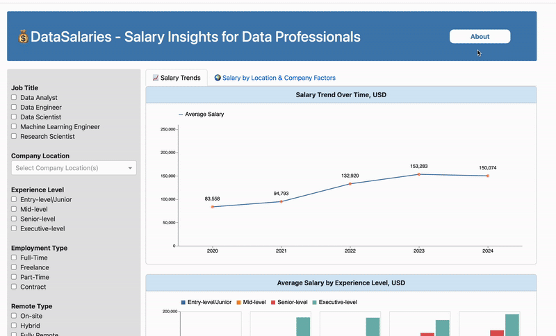

# 💰 DataSalaries - Salary Insights for Data Professionals

***Explore salary trends, compare pay across roles, and make informed career decisions💼***

## 🎉 Welcome!  
Thank you for visiting DataSalaries! This is an interactive dashboard designed to provide data-driven salary insights across various data-related roles. By examining trends over time and comparing salaries across various roles, experience levels, and work environments, the dashboard delivers actionable insights for job seekers, employers, and industry analysts. Our goal is to help users make informed decisions about compensation and career planning based on reliable, data-driven insights.

Jump straight to a section below, or scroll down to learn more!  

- [Who We Are](#-who-we-are)
- [Why We Built This](#-why-we-built-this) 
- [Features & Demo](#-features--demo)  
- [Running Locally](#-running-locally)  
- [Get Involved](#-get-involved)  
- [License & Data Source](#-license--data-source) 

## 👥 Who We Are
The DataSalaries Dashboard was developed by a group of data professionals, including Jessie Zhang, Rashid Mammadov, Tianjiao Jiang, and Karlygash Zhakupbayeva. Driven by a passion for data analytics, our team is dedicated to enhancing salary transparency and providing actionable career insights for data professionals. By combining expertise in data science and labor market trends, we aim to empower job seekers and employers with data-driven insights for informed decision-making.

## 📌 Why We Built This  

### The Problem  
Salaries in data-related jobs vary widely based on different factors such as experience level, company size, and remote type, etc. However, transparent salary benchmarks remain difficult to access, making it hard for professionals to negotiate fair pay and for companies to make competitive hiring decisions. If we could analyze the key factors influencing salaries in data-related roles, we could provide valuable insights to professionals navigating the job market.  

### The Solution  
DataSalaries provides **interactive salary visualizations**, allowing users to:  
- Analyze salary distributions across job roles, experience levels, and employment types  
- Compare remote vs. on-site pay to evaluate work preferences  
- Track salary trends over time to make informed career moves  

By providing salary trends from various perspectives, we believe our dashboard app could empower job seekers and employers with clear, data-driven salary insights for better decision-making.  

## 📊 Features  

✅ **Salary Trends Over Time**: Track salary evolution across years   
✅ **Filter by Key Factors**: Customize views based on job title, experience level, and employment setup  
✅ **Intuitive Visualizations**: Interactive bar charts, pie charts, and trend lines for easy exploration

### The Dashboard Demo

The dashboard provides an intuitive interface for exploring salary trends across multiple dimensions.  
- Users can try the dashboard here 👉 [Deployed Link](TODO: Insert the live link)
- Here is a short demo GIF showcasing the dashboard in action: 

## 💻 Running Locally
To run this dashboard on your local machine, please follow the instructions provided below: 

1. **Clone the repository and change directory to the project root:**
    ```bash
    git clone https://github.com/UBC-MDS/DSCI-532-2025-19-DataSalaries.git
    cd DSCI-532-2025-19-DataSalaries
    ```

2. **Create and activate the conda environment:**
    ```bash
    conda env create --file environment.yaml
    conda activate datasalaries
    ```

3. **Run the dashboard:**
    ```bash
    python src/app.py
    ```

4. **View the Dashboard:**  
After running the app, open your browser and navigate to: [http://127.0.0.1:8050/](http://127.0.0.1:8050/)  

You should now see the DataSalaries Dashboard live!

## 🙌 Get Involved  

We welcome contributions!  

✔️ **Want to help improve the dashboard?**  
Check out our [Contributing Guidelines](CONTRIBUTING.md) and adhere to our [Code of Conduct](CODE_OF_CONDUCT.md).  

✔️ **Found a bug or have a suggestion?**  
Open an issue on GitHub!  

✔️ **Need support?**  
If you encounter any issues, please reach out by opening an issue on GitHub or contacting the team via zhangj24@student.ubc.ca.    

## 📝 License & Data Source  

### Licenses  
- MIT license
- Creative Commons Attribution-NonCommercial-NoDerivatives 4.0 International (CC BY-NC-ND 4.0) license

### Dataset Attribution
This project uses data from the [Global Tech Salary Dataset](https://www.kaggle.com/datasets/yaaryiitturan/global-tech-salary-dataset/code) available on Kaggle.